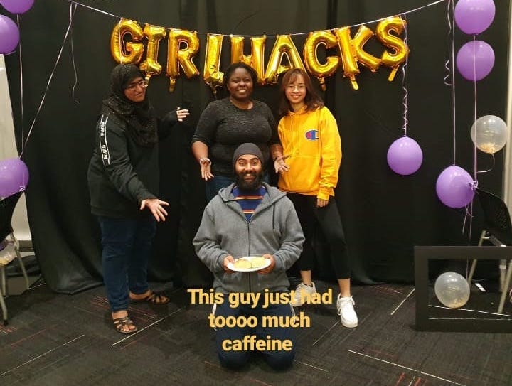
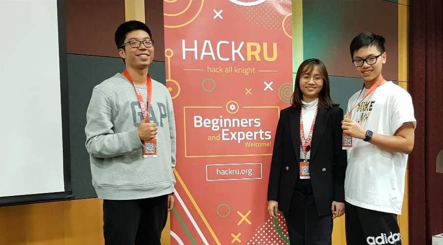
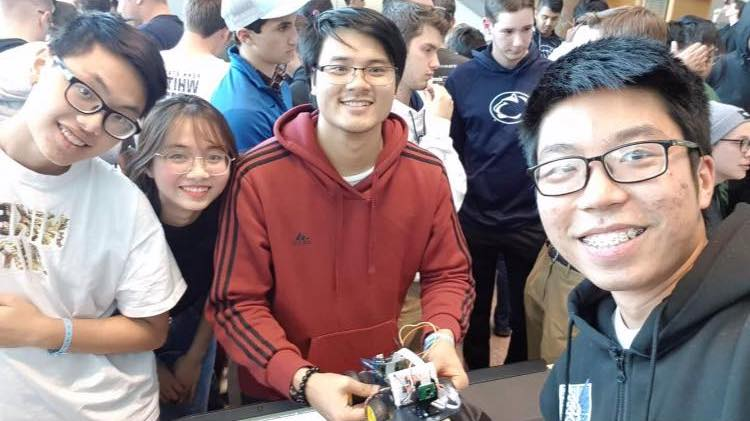

# My Story of Attending 14 Hackathons
Published: July 23rd, 2022

I didn't know what a hackathon is until seeing someone winning their first place award on LinkedIn. I didn't know how to code before college and hadn't built any project at that time. I get motivated to attend a hackathon and win something when I see people sharing their winning experience on LinkedIn. 

So I took the initiative, packed my 2017 Macbook and some clothes, and took the train to my first hackathon at New Jersey. I was a little bit scared cause it's my first time taking part in a hackathon. Though it seems like I stepped out of my comfort zone, I choose to go to a hackathon for women as my comfort treat. 

## My First Hackathon

In my first hackathon, I get into a room of strangers, talking to each other trying to form a group. We have an idea of building a classifier for ripe avocado with a motivation to reduce the food waste. 

## The First Hackathon Win

YESSSS, I got my first hacakthon win at my second hackathon. This time, I paired up with my friends and took the train to New Jersey to attend HackRU 2019. We brainstormed many cool, crazy, fun ideas. I would say the idea is what make us win the project.

## The Second Hackathon Win

In our second hackathon, we build a rover from scratch. We take the opportunity to meet new friends at Penn State. 

## Washington Hackathon

## My latest Hackathon Win

