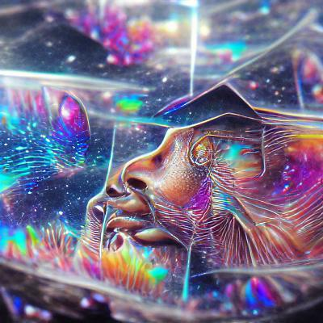

# My Journey in AI (So Far)
---
*Published: Aug 7th, 2022*

*Image with keywords "future" generated by AI model. Create your own at: *

AI is a hot domain right now. From 2010 to 2021, the total number of AI publications doubled, growing from 162,444 in 2010 to 334,497 in 2021. 

Many people are excited about getting into the field, and so am I. What excites me about AI/ML is the potential to make things easier for humans. AI can help predict cancer, grows more crops, and optimize water usage.  

## Summer Research Program
My journey into AI all started with getting accepted to the STAR programs in the freshman summer. I had the opportunity to work on my professor's Ph.D. thesis. 

The research is not about the latest research in AI but rather an alternative model for artificial intelligence in simulating intelligence. 

I learned to read research papers in computer science and psychology. 

AI is not about machine learning. 

## Hackathons & Projects
The next step in my journey is building projects using machine learning techniques. 

I attended a few hackathons and built projects using the latest machine learning techniques and tools. We don't build the whole model from scratch but rather use pre-trained machine learning models, which are trained on big datasets by experts in the field and have high accuracy. 

Projects are fun. 

Projects 1

Projects 2

## Research labs

## Coursera Certificates are not enough
The homework and quizzes are not that demanding, and you barely push yourself to understand everything in the video lectures. 

### Certificates are quick ways to learn new tools 

### Certificates are accessible

## College Courses
College classes provide the fundamentals and consolidate what I've learned before. Homeworks, quizzes, and tests push me to understand everything. 

However, 

## Hmm? Should I study Master's or Ph.D. next?
I just took 3 undergraduate classes in AI/ML and felt like I touched the tip of the AI/ML iceberg. 

## Conclusion
There're many ways to learn AI/Ml. 